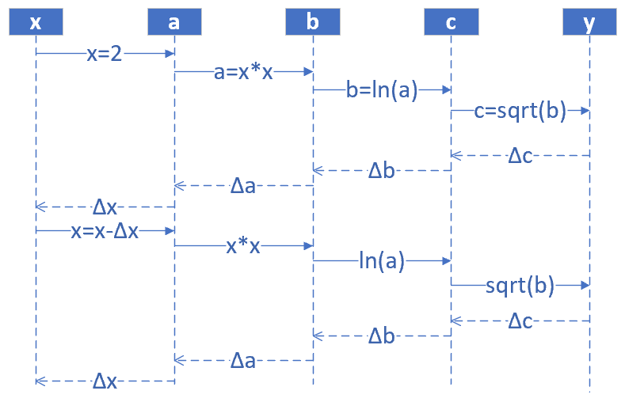

# 非线性反向传播

## 提出问题

在上面的线性例子中，我们可以发现，误差一次性地传递给了初始值w和b，即，只经过一步，直接修改w和b的值，就能做到误差校正。因为从它的计算图看，无论中间计算过程有多么复杂，它都是线性的，所以可以一次传到底。缺点是这种线性的组合最多只能解决线性问题，不能解决更复杂的问题。这个我们在神经网络基本原理中已经阐述过了，需要有激活函数连接两个线性单元。

下面我们看一个非线性的例子，如图2-8所示。



其中$$1<x<=10，0<y<2.15$$。假设有5个人分别代表x、a、b、c、y：

### 正向过程

1. 第1个人，输入层，随机输入第一个x值，x取值范围\(1,10\]，假设第一个数是2
2. 第2个人，第一层网络计算，接收第1个人传入x的值，计算：$$a=x^2$$
3. 第3个人，第二层网络计算，接收第2个人传入a的值，计算b：$$b=\ln (a)$$
4. 第4个人，第三层网络计算，接收第3个人传入b的值，计算c：$$c=\sqrt{b}$$
5. 第5个人，输出层，接收第4个人传入c的值

### 反向过程

1. 第5个人，计算y与c的差值：$$\Delta c = c - y$$，传回给第4个人
2. 第4个人，接收第5个人传回$$\Delta c$$，计算$$\Delta b：\Delta b = \Delta c \cdot 2\sqrt{b}$$
3. 第3个人，接收第4个人传回$$\Delta b$$，计算$$\Delta a：\Delta a = \Delta b \cdot a$$
4. 第2个人，接收第3个人传回$$\Delta a$$，计算$$\Delta x：\Delta x = \Delta a / 2x$$
5. 第1个人，接收第2个人传回$$\Delta x$$，更新$$x：x = x - \Delta x$$，回到第1步

提出问题：假设我们想最后得到c=2.13的值，x应该是多少？（误差小于0.001即可）

## 数学解析解

$$c=\sqrt{b}=\sqrt{\ln(a)}=\sqrt{\ln(x^2)}=2.13$$

$$x = 9.6653$$

## 梯度迭代解

$$ \frac{da}{dx}=\frac{d(x^2)}{dx}=2x=\frac{\Delta a}{\Delta x} \tag{1} $$

$$ \frac{db}{da} =\frac{d(\ln{a})}{da} =\frac{1}{a} = \frac{\Delta b}{\Delta a} \tag{2} $$

$$ \frac{dc}{db}=\frac{d(\sqrt{b})}{db}=\frac{1}{2\sqrt{b}}=\frac{\Delta c}{\Delta b} \tag{3} $$

因此得到如下一组公式，可以把最后一层$$\Delta c$$的误差一直反向传播给最前面的$$\Delta x$$，从而更新x值： 

$$ \Delta c = c - y \tag{4} $$

$$ \Delta b = \Delta c \cdot 2\sqrt{b} \tag{根据式3} $$

$$ \Delta a = \Delta b \cdot a \tag{根据式2} $$

$$ \Delta x = \Delta a / 2x \tag{根据式1} $$

我们给定初始值$$x=2，\Delta x=0$$，依次计算结果如表2-2。

表2-2 正向与反向的迭代计算

| 方向 | 公式 | 迭代1 | 迭代2 | 迭代3 | 迭代4 | 迭代5 |
| :--- | :--- | :--- | :--- | :--- | :--- | :--- |
| 正向 | $$x=x-\Delta x$$ | 2 | 4.243 | 7.344 | 9.295 | 9.665 |
| 正向 | $$a=x^2$$ | 4 | 18.005 | 53.934 | 86.404 | 93.233 |
| 正向 | $$b=\ln(a)$$ | 1.386 | 2.891 | 3.988 | 4.459 | 4.535 |
| 正向 | $$c=\sqrt{b}$$ | 1.177 | 1.700 | 1.997 | 2.112 | 2.129 |
|  | 标签值y | 2.13 | 2.13 | 2.13 | 2.13 | 2.13 |
| 反向 | $$\Delta c = c - y$$ | -0.953 | -0.430 | -0.133 | -0.018 |  |
| 反向 | $$\Delta b = \Delta c \cdot 2\sqrt{b}$$ | -2.243 | -1.462 | -0.531 | -0.078 |  |
| 反向 | $$\Delta a = \Delta b \cdot a$$ | -8.973 | -26.317 | -28.662 | -6.698 |  |
| 反向 | $$\Delta x = \Delta a / 2x$$ | -2.243 | -3.101 | -1.951 | -0.360 |  |

表2-2，先看“迭代-1”列，从上到下是一个完整的正向+反向的过程，最后一行是-2.243，回到“迭代-2”列的第一行，2-\(-2.243\)=4.243，然后继续向下。到第5轮时，正向计算得到的c=2.129，非常接近2.13了，迭代结束。

运行示例代码的话，可以得到如下结果：

```text
how to play: 1) input x, 2) calculate c, 3) input target number but not faraway from c
input x as initial number(1.2,10), you can try 1.3:
2
c=1.177410
input y as target number(0.5,2), you can try 1.8:
2.13
forward...
x=2.000000,a=4.000000,b=1.386294,c=1.177410
backward...
delta_c=-0.952590, delta_b=-2.243178, delta_a=-8.972712, delta_x=-2.243178

forward...
x=4.243178,a=18.004559,b=2.890625,c=1.700184
backward...
delta_c=-0.429816, delta_b=-1.461533, delta_a=-26.314258, delta_x=-3.100772

forward...
x=7.343950,a=53.933607,b=3.987754,c=1.996936
backward...
delta_c=-0.133064, delta_b=-0.531440, delta_a=-28.662487, delta_x=-1.951435

forward...
x=9.295386,a=86.404194,b=4.459036,c=2.111643
backward...
delta_c=-0.018357, delta_b=-0.077527, delta_a=-6.698641, delta_x=-0.360321

forward...
x=9.655706,a=93.232666,b=4.535098,c=2.129577
backward...
done!
```

第一步时c=1.177410，最后一步时c=2.129577，停止迭代。


## 完整代码

原代码位置：[ch02, Level2](https://github.com/microsoft/ai-edu/blob/master/A-%E5%9F%BA%E7%A1%80%E6%95%99%E7%A8%8B/A2-%E7%A5%9E%E7%BB%8F%E7%BD%91%E7%BB%9C%E5%9F%BA%E6%9C%AC%E5%8E%9F%E7%90%86%E7%AE%80%E6%98%8E%E6%95%99%E7%A8%8B/SourceCode/ch02-BASIC/Level2_BP_NoneLinear.py)

```python
import numpy as np
import matplotlib.pyplot as plt

def draw_fun(X,Y):
    x = np.linspace(1.2,10)
    a = x*x
    b = np.log(a)
    c = np.sqrt(b)
    # 正常计算得到的函数曲线
    plt.plot(x,c)

    # 绘制计算的每一步
    plt.plot(X,Y,'x')
    plt.show()

def forward(x):
    a = x * x
    b = np.log(a)
    c = np.sqrt(b)
    return a, b, c

def backward(x, a, b, c, y):
    loss = c - y
    delta_c = loss
    delta_b = delta_c * 2 * np.sqrt(b)
    delta_a = delta_b * a
    delta_x = delta_a / 2 / x
    return loss, delta_x, delta_a, delta_b, delta_c


def update(x, delta_x):
    x = x - delta_x
    if x < 1:
        x = 1.1
    return x


if __name__ == '__main__':
    print("how to play: 1) input x, 2) calculate c, 3) input target number but not faraway from c")
    print("input x as initial number(1.2,10), you can try 1.3:")
    line = input()
    # 输入一个初始值x，x在1.2-10之间
    x = float(line)

    a, b, c = forward(x)
    print("c=%f" % c)
    print("input y as target number(0.5,2), you can try 1.8:")
    line = input()
    # 输入一个你想得到的数字y, 在0.5-2之间，输入的y与计算的c形成误差
    y = float(line)

    error = 1e-3

    X, Y = [], []

    for i in range(20):
        # forward
        print("forward...")
        a, b, c = forward(x)
        print("x=%f,a=%f,b=%f,c=%f" % (x, a, b, c))
        X.append(x)
        Y.append(c)
        # backward
        print("backward...")
        loss, delta_x, delta_a, delta_b, delta_c = backward(x, a, b, c, y)
        if abs(loss) < error:
            print("done!")
            break
        # update x
        x = update(x, delta_x)
        print("delta_c=%f, delta_b=%f, delta_a=%f, delta_x=%f\n" % (delta_c, delta_b, delta_a, delta_x))

    draw_fun(X, Y)
```

